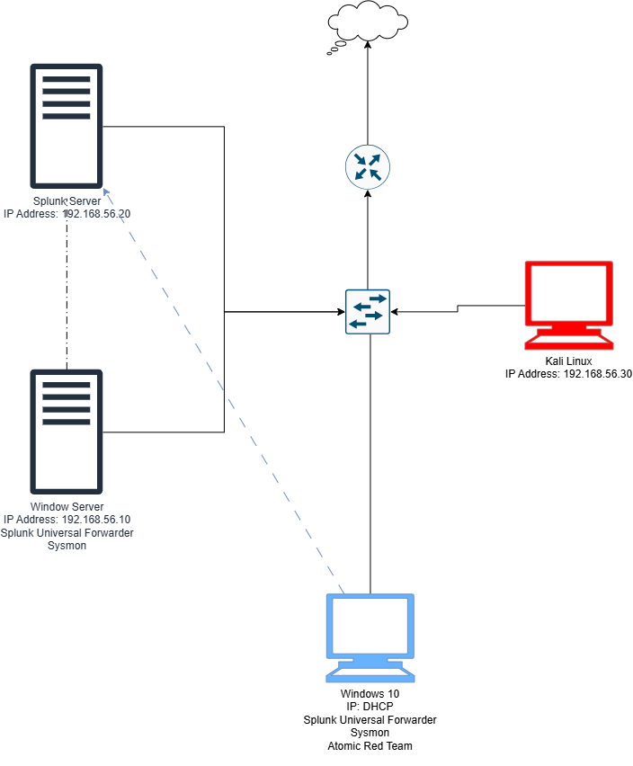

# Initial SOC Lab Design

## Overview

Before implementing the SOC home lab, I designed an initial architecture to define the systems, network segmentation, and security monitoring workflow.

The purpose of the initial design was to understand how the different components would interact before deploying the virtual machines.

## Initial Objectives

The planned environment was designed to provide hands-on experience with:

- Active Directory
- Windows administration
- Linux administration
- Kali Linux
- Splunk Enterprise
- Endpoint monitoring
- Sysmon
- Security event collection
- SIEM-based detection and investigation

## Initial Architecture



## Design Concept

The initial design separated the environment into an internal lab network and an external/Internet-facing network.

The domain controller was planned as the central infrastructure component, providing Active Directory and DNS services.

Windows endpoints would generate security telemetry, while Splunk would act as the central SIEM for collecting and analyzing the events.

## Planned Security Monitoring Flow

```text
Windows Endpoint
       |
     Sysmon
       |
Windows Event Logs
       |
Universal Forwarder
       |
    Splunk
       |
Detection & Investigation
