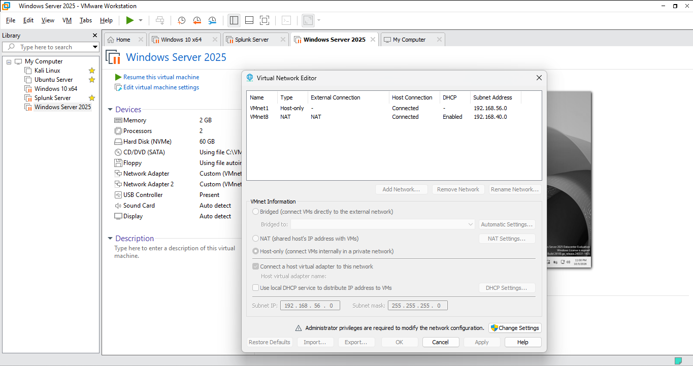

# Final SOC Home Lab Architecture

## Overview

The final SOC home lab is a virtualized enterprise-style security monitoring environment built with VMware Workstation.

The environment combines Windows infrastructure, Active Directory, Linux systems, Kali Linux, endpoint telemetry, and Splunk Enterprise to provide hands-on experience with security monitoring, detection engineering, and incident investigation.

The final architecture evolved from the initial design after implementing and troubleshooting the environment.

## Final Architecture



## Virtual Machines

| System | Role | Operating System | IP Address |
|---|---|---|---|
| DC01 | Domain Controller, DNS, DHCP, RRAS/NAT | Windows Server 2025 | 192.168.56.10 |
| Splunk01 | SIEM / Log Analysis | Ubuntu Server 24.04 | 192.168.56.20 |
| Windows 10 | Monitored Endpoint | Windows 10 | 192.168.56.30 |
| Kali | Security Testing / Investigation | Kali Linux | DHCP / Lab Network |
| Ubuntu | Linux Administration / Security Lab | Ubuntu Server | Lab Network |

## Network Architecture

The lab uses two VMware virtual networks.

### VMnet1 — Internal Lab Network

VMnet1 provides the isolated internal network used by the lab systems.

```text
Network: 192.168.56.0/24
